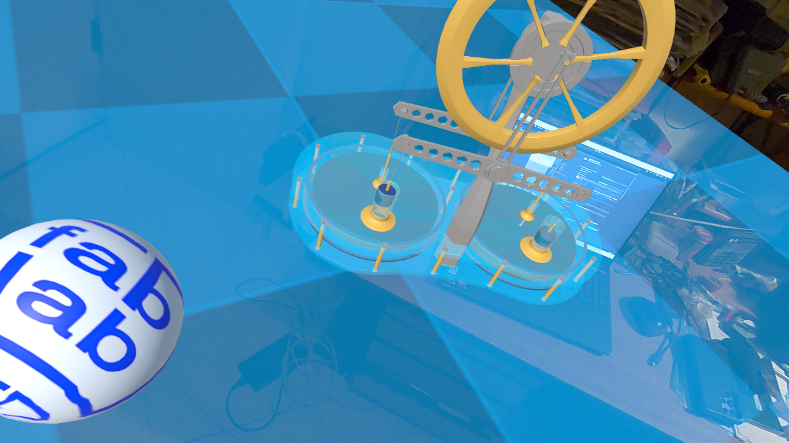

# Unity Meta Quest 3 Project: Physics Interaction & Passthrough



This project is a technical demonstration for the **Meta Quest 3**, featuring **Passthrough (Mixed Reality)**, advanced physics, and the **Oculus Interaction SDK**.

The application allows users to manipulate virtual objects within their real-world environment using Hand Tracking or Controllers.

## Key Features

### 1. Mixed Reality (Passthrough)

- Uses the **AR/Passthrough** camera to overlay virtual elements onto the real world.
- The scene background is transparent, allowing the user's physical environment to be visible.

### 2. Building Blocks

The project is built upon Meta's modular "Building Blocks" architecture:

- **Camera Rig**: Manages the stereoscopic camera and head tracking.
- **Grabbable Item**: Pre-configured components to make objects grabbable.
- **Passthrough**: Manages the video feed of the real world.

### 3. Physics & Gravity

- **Invisible Floor**: A plane configured as an invisible Collider aligned with the real floor, preventing objects from falling infinitely.
- **Reactive Objects**:
  - **Interactive Cubes**: Basic blocks subject to gravity, which can be thrown, stacked, or pushed.
  - **Custom Prefabs (e.g., Stirling Engine)**: Integration of complex 3D models within a physical shell (Parent "Building Block" + Child "Visual").
  - Precise collision (Continuous Dynamic) to prevent objects from clipping through the floor or intersecting each other.

### 4. Custom Scripts

- **SlowRotate.cs**: A script allowing an object (like a sphere) to rotate automatically.
  - *Smart Interaction*: Rotation stops automatically when the user grabs the object and resumes when released (via `Pointable Unity Event Wrapper`).

### 5. MCC Connectivity (Remote Control)

This project includes a powerful **MQTT Manager** allowing you to control any object in the scene remotely by sending JSON messages.

- **Topic IN**: `FABLAB_21_22/Unity/metaquest/in` (Receives commands)
- **Topic OUT**: `FABLAB_21_22/Unity/metaquest/out` (Sends status/hello)

#### Supported JSON Commands

You can control Position, Rotation, Scale (Zoom), and Continuous Rotation Speed. The script updates the target object by finding it via `targetName`.

```json
{
  "targetName": "Cube",
  "position": { "x": 0.0, "y": 1.5, "z": 2.0 },
  "rotation": { "x": 0.0, "y": 45.0, "z": 0.0 },
  "scale": { "x": 1.5, "y": 1.5, "z": 1.5 },
  "rotationSpeed": { "x": 10.0, "y": 90.0, "z": 0.0 }
}
```

- **targetName**: Name of the GameObject in the Hierarchy.
- **position**: Updates world position.
- **rotation**: (Optional) Updates absolute rotation (Euler angles).
- **scale**: (Optional) Updates local scale. Set to > 0.
- **rotationSpeed**: (Optional) Sets a continuous rotation speed (degrees/second). Set to `0,0,0` to stop.

#### Gauge Control (Universal)

To control any gauge (thermometer, manometer, speedometer...), use the **`gauge_value`** key.

```json
{
  "targetName": "thermometer",
  "gauge_value": 22.5
}
```

- **gauge_value**: The value to apply (e.g., °C, Bar, km/h).
- The script looks for your calibration (Min/Max/Angle) in the **Gauge Bindings** list.
- If no binding is found, it defaults to 0-100 range.
- It rotates the child object named **"Pointer"** inside your target.

*Example for pressure:*

```json
{
  "targetName": "manometer",
  "gauge_value": 5.0
}
```

### 6. Gauge Bindings (Dedicated Topics)

You can control specific gauges by listening to **dedicated topics** (Raw text values, not JSON). This is ideal for connecting real sensors directly.
The system uses a **Universal Gauge** logic for all types (Thermometer, Manometer, Speedometer, etc.).

**Setup in Inspector:**

1. Select the **MqttManager** object.
2. Expand the **Gauge Bindings** list.
3. Add a new element and configure:
   - **Topic**: e.g., `sensor/kitchen/temp`
   - **Target Name**: e.g., `Thermometer_Kitchen`
   - **Type**: Select `Gauge`.

**Calibration:**

- **Min Value / Max Value**: Defines the sensor range (e.g. -10 to 40).
- **Max Angle**: How many degrees the needle rotates for the full range (e.g. 180).
- **Value Child**: Name of the TextMeshPro object to display the value (default: "Value"). Leave empty to disable text.

**Formula used:**
`Angle = -Value * (MaxAngle / (MaxValue - MinValue))`
*(The needle rotates proportionally to the range amplitude. If Value = 0, Angle = 0).*

**Example:**

- Publish `24.5` to `sensor/kitchen/temp` -> Updates needle based on your Min/Max settings.

#### Configuration & Secrets

Credentials are secure and **not committed** to Git.
Create a file at `Assets/Resources/secrets.json`:

```json
{
    "mqttUser": "your_user",
    "mqttPassword": "your_password",
    "mqttPort": 8443
}
```

*Note: If port 8443 or 8883 is used, SSL/TLS encryption is automatically enabled.*

## Technical Architecture

### Interactive Object Structure

To ensure stable physics with imported 3D models, we use the "Driver / Passenger" structure:

- **Parent (Empty GameObject or Invisible Cube)**:
  - Contains the `Rigidbody` (Physics Engine).
  - Contains the `Box Collider` (Simple collision shell).
  - Contains the `Grabbable` scripts (Interaction Logic).
- **Child (3D Model)**:
  - Contains only the `Mesh Filter` and `Mesh Renderer`.
  - No physics on the child to avoid conflicts.

### Physics Configuration

- **Floor**: Flattened `Box Collider` (negative Y offset) to prevent physical explosion effects on startup.
- **Objects**: `Collision Detection` set to **Continuous Dynamic** to prevent tunneling (passing through walls) during fast movements.

## Tech Stack & SDKs

### Why not AR Foundation?

Although AR Foundation is excellent for cross-platform mobile (iOS/Android), for this specific **Meta Quest 3** project, we prioritized the **Native Meta XR SDKs**.

- **Direct Access**: They offer more direct and optimized access to Quest-exclusive features (High-fidelity Hand Tracking, Scene Understanding, Depth API).
- **Building Blocks**: Using pre-fabricated "blocks" drastically speeds up development compared to the manual setup required under AR Foundation.
- **Advanced Interactions**: The Interaction SDK provides hand physics and gestures (Poke, Grab, Ray) far richer than the basic standard.

### Required Meta SDKs

To run this project, the following packages (often installable via *Meta XR All-in-One SDK*) are essential:

1. **Meta XR Core SDK**: The core system (camera management, tracking, inputs).
2. **Meta XR Interaction SDK**: Handles all grabbing logic, virtual hands, and gesture detection.
3. **Meta XR Building Blocks**: Provides the "turnkey" components (Camera Rig, Passthrough, Grabbable Item) used here.

## How to Run

1. Open the project in **Unity 6** (or a Meta XR compatible version).
2. Ensure the platform is set to **Android** (Settings > Build Settings).
3. Connect a **Meta Quest 3** headset via Link or build the APK (`Build and Run`).
4. Once in the headset, allow access to spatial data (Passthrough).
5. Interact with the cubes and sphere: they will fall onto your real floor!

## Pendulum Configuration (via MQTT)

The pendulum can be controlled and configured in real-time via the topic `FABLAB_21_22/Unity/Pendule/in`.
The message must be in JSON format. All parameters are optional and can be sent together or separately.

### JSON Parameters

| Key | Type | Unit / Range | Description |
| :--- | :--- | :--- | :--- |
| **`angle_init`** | `float` | Degrees (-180 to +180) | Resets the pendulum position. Triggers a smooth transition animation (2s) before releasing physics. |
| **`m`** | `float` | kg (approx) | Defines the **Mass** of the pendulum (`Rigidbody.mass`). Higher mass increases inertia. |
| **`alpha`** | `float` | Unity Linear Drag (0 to infinite) | Defines **Fluid Friction** (air resistance). <br>Note: Mapped to `Rigidbody.linearDamping`. Higher values decelerate the pendulum proportionally to its speed. Recommended values: 0.5 to 5 (oscillating), 10+ (highly damped). |
| **`fs`** | `float` | Torque (N.m) | Defines **Solid Friction** (dry) via a motor brake on the axis (`HingeJoint`). <br>- If `> 0`: Applies a constant braking torque. <br>- If `0`: Completely disables the motor (freewheel). |

### Payload Examples

- **Simple Reset:**

    ```json
    { "angle_init": -45.0 }
    ```

- **Full Physics Configuration:**

    ```json
    {
      "m": 2.5,
      "alpha": 0.1,
      "fs": 0.5
    }
    ```

- **Reset with Physics Change (Mega-Message):**

    ```json
    {
      "angle_init": 90,
      "m": 1.0,
      "alpha": 20.0,  // Strong fluid damping
      "fs": 0         // No dry friction
    }
    ```

## Double Pendulum (Coupled Pendulums)

This project supports the simulation and control of two coupled pendulums.

### Monitoring Output

Publishes the angles of both pendulums.

- **Topic**: `FABLAB_21_22/Unity/PendulesCouples/out`
- **JSON Format**:

  ```json
  {
    "temps": 12.3456,
    "theta1": 45.1234,
    "theta2": -12.5678
  }
  ```

### Control Input

Controls initial positions and physics parameters.

- **Topic**: `FABLAB_21_22/Unity/PendulesCouples/in`
- **JSON Format** (All parameters are optional):

  ```json
  {
    "th1_i": 90.0,   // Initial Angle Pendulum 1 (Degrees)
    "th2_i": 0.0,    // Initial Angle Pendulum 2 (Degrees)
    "f": 0.5,        // Fluid Friction (Linear Damping)
    "C": 100.0,      // Coupling Constant (Torsion Spring)
    "m1": 1.5,       // Mass Pendulum 1 (kg)
    "m2": 0.5        // Mass Pendulum 2 (kg)
  }
  ```
